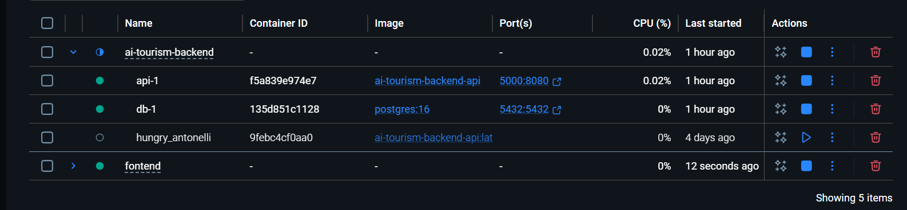

1. Yêu cầu hệ thống
Tải docker về máy: https://www.docker.com/products/docker-desktop/
Clone dự án FE về máy: git clone https://github.com/kimle6924-ops/ai-tourism-frontend.git
2. Build và khởi chạy hệ thống
Chạy lệnh này lần đầu tiên hoặc có sửa phía FE thì chạy lại(Lưu ý mở docker desktop lên):  docker compose up --build
3. Khởi chạy dự án
Vào trình duyệt bất kỳ và truy cập vào link: http://localhost:3000

// Lưu ý lần sau chỉ cần mở docker và chạy lại dự án bên trong container có hình tam giác là được

==================================================================
Cách 2: 
1. Yêu cầu hệ thống:
Tải nodejs: https://nodejs.org/en/download
2. Clone dự án FE về máy: git clone https://github.com/kimle6924-ops/ai-tourism-frontend.git
3. Mở dự ấn trong IDE và chạy lệnh: npm install
4. Chạy lệnh: npm start

//Lưu ý chỉ cần chạy lệnh npm install khi có thay đổi file package.json
các lần sau chỉ cần "npm start"